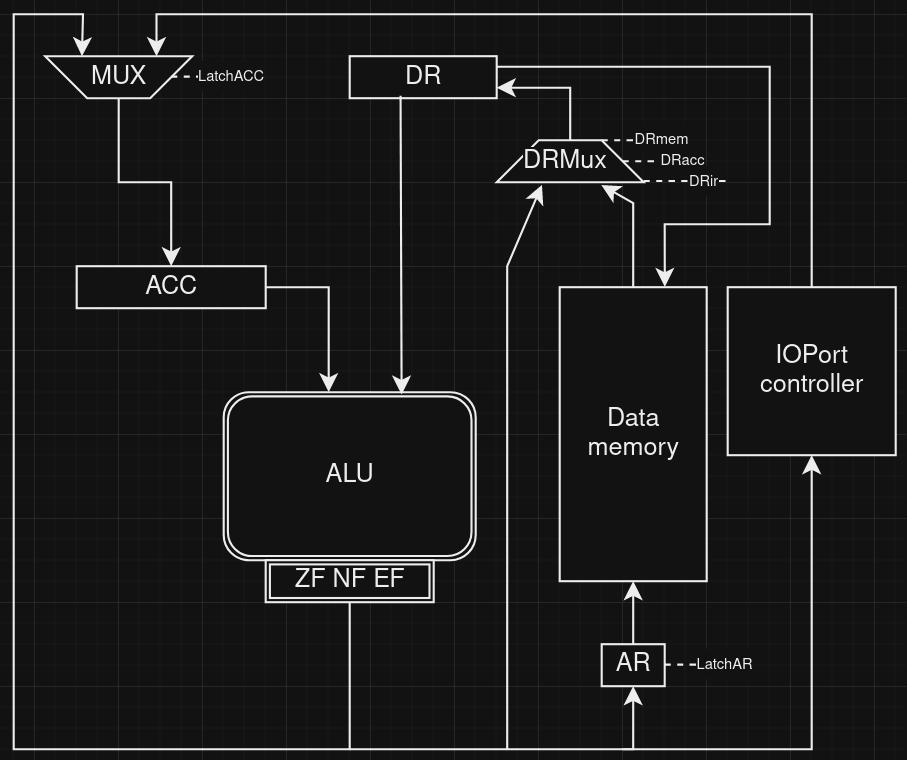
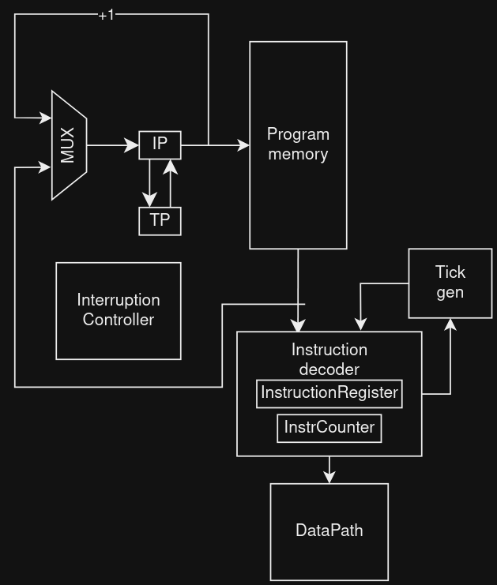

# Аккумуляторный процессор. Транслятор и модель

- Бессонов Владимир Юрьевич, P3212
- `asm | acc | harv | hw | tick -> instr | struct | trap -> stream | port | cstr | prob2 | cache`
- Базовый вариант (без усложнения)

## Язык программирования

Пример синтаксиса:
- `(...)` - повторение 0 или более раз
- `{...}` - вхождение 1 или более раз

```ebnf
program ::= {memory_unit} "\n" (interruption_service_routine) "\n" {instruction}

memory_unit ::= var_name "=" value

interruption_service_routine ::= port " " handler_label

instruction ::= op0
              | op1 label_name
              | op2 arg
              | op3 port
              
op0 ::= "INC"
      | "DEC"
      | "NEG"
      | "HLT"
      | "IRET"
      | "IN"
      | "EI"
      | "DI"

op1 ::= "JZ"
      | "JMP"
      | "JE"
      | "JN"
      
op2 ::= "LD"
      | "ST"
      | "CMP"
      | "ADD"
      | "SUB"
      | "MUL"
      | "DIV"
      
op3 ::= "OUT"

label_name ::= <".">{ <any of "a-z A-Z 0-9"> }

arg ::= literal | var_name | (var_name)

port ::= <"#">{integer}
```

Операции:

- `HLT` -- прекращение работы
- `ST` -- сохранение значения `AC` в память
- `LD` -- загрузка значения из памяти в `AC`
- `IN` -- ввод
- `OUT` -- вывод на указанный порт
- `ADD` -- сложение `AC` и значения `DR`, сохранение в `AC`
- `SUB` -- вычитание из `AC` значения `DR`, сохранение в `AC`
- `MUL` -- произведение `AC` и значения `DR`, сохранение в `AC`
- `DIV` -- деление `AC` на значение `DR`, сохранение в `AC`
- `INC` -- инкремент `AC`
- `DEC` -- декремент `AC`
- `NEG` -- смена знака `AC`
- `CMP` -- выставление флагов по результатам вычитания `AC`-`DR`
- `JMP` -- безусловный переход на адрес в памяти команд
- `JZ` -- переход если выставлен `ZeroFlag`
- `JN` -- переход при выставленном `NegativeFlag`
- `JE` -- переход при выставленном `EvenFlag`
- `INR` -- запрос прерывания на ввод, аргумент - адрес хэндлера прерывания
- `IRET` -- возврат из прерывания

## Организация памяти

- Память соответствует Гарвардской архитектуре.
- Размер машинного слова - 8 бит.
- Три режима адресации: прямая загрузка операнда (numeric литерала), стандартная, косвенная.
- Поддержка строковых литералов
- Есть поддержка секций-лейблов. `.data` - переменные, сохранятся в память данных. `.code` - команды,
сохранятся в память команд, `.isr` - привязка хэндлера прерывания к устройству IO. 

```text
type DataMemUnit struct {
	Idx int    `json:"idx"` // индекс
	Key string `json:"-"`   // название переменной, не отразится в машинном коде
	Sec string `json:"-"`   // название секции, не отразится в машинном коде
	Val int    `json:"val"` // значение
}
```

## Система команд

Особенности процессора:

- Хранятся в специальной секции `.code`
- Доступ к памяти команд осущетвляется по `PC (programm counter)`
  - Текущая инструкция выбирается по `PC` из памяти команд, содержится в `IR (instruction register)`
  - При переходе в прерывание `PC` сохраняется в `TP (temporary pointer)`
- Control flow:
  - переходы по флагам `ZeroFlag`, `NegativeFlag`, `EvenFlag` соответственно: `JZ`, `JN`, `JE`, `JMP` - безусловный

### Набор инструкций

Перед выполнением инструкций всегда происходит цикл выборки инструкции `instruction fetch`, затем выполняются инструкции
`control flow`, затем цикл выборки операнда `operand fetch`, если команд адресная, после чего следует выполнение 
операции.

| Инструкция | Кол-во тактов |
|:-----------|---------------|
| LD         | 1             |
| ST         | 3             |
| CMP        | 2             |
| JZ         | 1             |
| JMP        | 1             |
| JE         | 1             |
| JN         | 1             |
| OUT        | 1             |
| MUL        | 1             |
| DIV        | 1             |
| ADD        | 1             |
| SUB        | 1             |
| INC        | 1             |
| DEC        | 1             |
| NEG        | 1             |
| HLT        | 1             |
| IRET       | 1             |
| IN         | 1             |
| EI         | 1             |
| DI         | 1             |

Приведены такты исполнения без учета `instruction fetch` (1 такт) и `operand fetch` (1-4 такта).

### Кодирование инструкций

Память команд хранит инструкции, содержащие, в свою очередь, индекс, опкод, аргумент и режим адресации - `DIRECT`, 
`DEFAULT` или `RELATIVE`.

```text
type Operation struct {
	Idx      int      `json:"idx"`
	Cmd      Opcode   `json:"cmd"`
	Arg      int      `json:"arg"`
	AddrMode AddrMode `json:"adr"`
}
```

## Транслятор

Интерфейс командной строки: `go run . -t -in <.basm source> -out <.json destination>`

Реализовано в модуле: [translator](./machine/translator.go)

Этапы трансляции:

1. `ParseAssemblyCode` 
 - возвращает 
   ```
   type Assembly struct {
       DataSection []DataMemUnit
       Interrupts  map[string]int
       Ops         []string
       Sections    []Section
   }
   ```
  - раскидывает код по секциям
  - хэндлит численные и строковые литералы, выделяя под них слоты памяти в `data memory`
  - подготавливает индексы к ресолвингу на следующем этапе
2. `TranslateAssemblyToMachine`
  - возвращает
    ```
    type MachineCode struct {
        Data []DataMemUnit `json:"data"`
        Ints map[int]int   `json:"ints"`
        Ops  []Operation   `json:"code"`
    }
    ```
  - ресолвинг лейблов
  - ресолвинг режимов адресации

Правила трансляции:

- Обязательны секции `.data`, `.code`, опциональна секция `.ints`
- Строки в `data memory` могут храниться нуль-терминированными, либо без терминатора
- Лэйблы (и секции) пишутся в отдельной строке

## Модель процессора

Интерфейс командной строки: `go run -e -in <.json source> -conf <.txt interrupt schedule> -out <.txt output>`

Реализован в модуле: [data_path](./machine/data_path.go)

### DataPath



`DRmux` защелкивает в `DR` значение из памяти (`DRmem`), из аккумулятора (`DRacc`) и из `instruction register` (`DRir`).
`AR`, по которому осуществляется загрузка/выгрузка значений памяти, может защелкиваться значением аргумента из 
`instruction register` или `DR`.
Под `ALU` - флаги `zero`, `negative`, `even` соответственно.

### ControlUnit



Реализован в модуле: [control_unit](./machine/control_unit.go)

- Hardwired.
- Выполнение и декодирование инструкций происходит в методе `decodeExecuteInstruction`
- Проверка на прерывание, исходящего от внешнего устройства в `checkInterrupt`
- Обработка прерывания в `handleInterrupt`. Происходит сохранение `instruction pointer` в `temporary pointer`, после
чего `instruction pointer` защелкивается индексом первой инструкции хэндлера прерывания.
- `tick` нужен считает такты, `instruction counter` - команды.

Особенности работы модели:

- Цикл симуляции осуществляется в функции `simulation`.
- Шаг моделирования соответствует одной инструкции, состояние выводится в журнал каждый такт.
- Количество инструкций для моделирования лимитировано.
- После выполнения новой инструкции происходит проверка на вызов прерывания.
- Остановка моделирования осуществляется при:
    - превышении лимита количества выполняемых инструкций;
    - выставленном флаге `halted` `control unit`-а.

## Тестирование

- Тестирование осуществляется при помощи golden test-ов.
- Конфигурация golden тестирования находится в [файле](./tests/machine_test.go)
- Конфигурация golden test-ов лежит в [директории](./golden)

Запустить тесты: `go test .`

Обновить конфигурацию golden tests:  `go test . -update`

CI при помощи Github Actions:

```yaml
name: Go

on:
  push:
    branches: [ "master" ]
  pull_request:
    branches: [ "master" ]

jobs:
  build:
    runs-on: ubuntu-latest
    steps:
      - uses: actions/checkout@v4

      - name: Set up Go
        uses: actions/setup-go@v4
        with:
          go-version: '1.20'

      - name: Install dependencies
        run: go mod tidy

      - name: Run tests with test2json
        run: |
          mkdir -p test-results
          go test -v ./... | tee test-results/output.txt | go tool test2json > test-results/output.json

      - name: Upload test results as artifact
        uses: actions/upload-artifact@v2
        with:
          name: test-results
          path: test-results
```

Журнал работы процессора на примере `ADD`:

```
TICK:   3 | IC:   1 | CMD:  ADD | ARG:        1 | AC:        1 | DR:        1 | AR:   0 | INT: false 
TICK:   4 | IC:   1 | CMD:  ADD | ARG:        1 | AC:        1 | DR:        1 | AR:   1 | INT: false 
TICK:   5 | IC:   1 | CMD:  ADD | ARG:        1 | AC:        3 | DR:        2 | AR:   1 | INT: false
```

```text
| name                      | alg        | src instr | instr | ticks |
| Бессонов Владимир Юрьевич | hello      | 13        | 65    | 215   |
| Бессонов Владимир Юрьевич | cat        | 13        | 121   | 276   |
| Бессонов Владимир Юрьевич | hello_user | 37        | 380   | 1284  |
| Бессонов Владимир Юрьевич | prob2      | 18        | 417   | 1340  |
```
